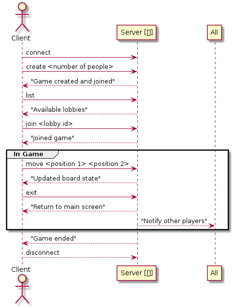

## Chinese checkers

Client-server implementation of Chinese checkers game. 

By Manfred Gawlas and Tomasz Piotrowski.

### Applications
System consists of two applications. Client and Server.

To compile and run programs:
```bash
cd server # or cd client

cd build
cmake ..
make
./server # or ./client
```

### System diagram


### Usage diagram


### To do
- Użyć instrukcji switch do określenia rodzaju gry na podstawie liczby graczy (client number).
- Stworzyć strukturę danych przechowującą stan gry (ruchy graczy i odpowiedzi serwera).
