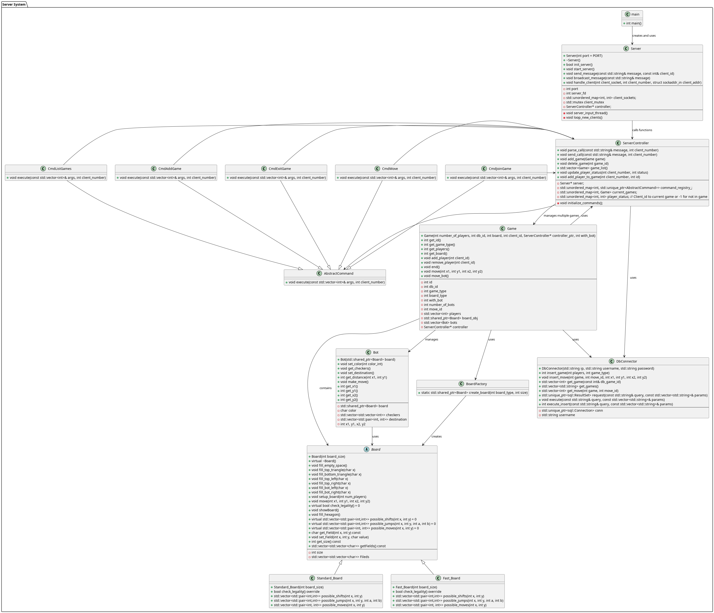

## Chinese checkers

Client-server implementation of Chinese checkers game. 

By Manfred Gawlas and Tomasz Piotrowski.

### Applications
System consists of two applications. Client and Server.

To compile and run programs:
```bash
cd server # or cd client

cd build
cmake ..
make
./server # or ./client
```

```bash
# Run docker service
sudo dockerd &

# Clean docker
sudo docker-compose down -v

# Run docker
sudo docker-compose build --no-cache
sudo docker-compose up -d

# For checking stuff
sudo docker-compose exec db mariadb -u admin -p cc_db
```

### System diagram


### Activity diagram for user

